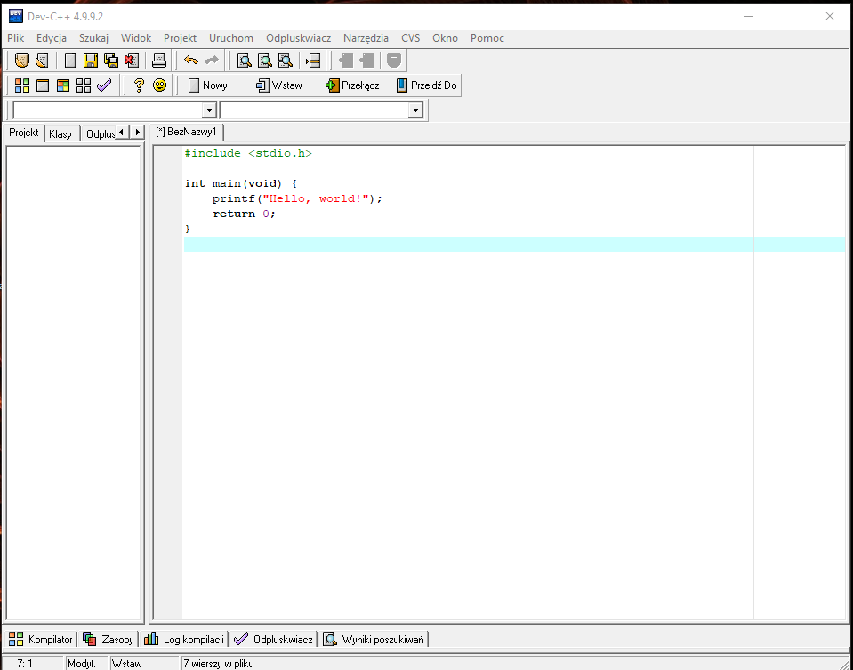

# C dla Początkującego

## Pierwszy program

Twój pierwszy program w C wyświetli na ekranie tekst "Hello, World!". W polu na kod źródłowy wpisz następującą treść:

```c

#include <stdio.h>

int main(void) {
    printf("Hello, world!");
    return 0;
}

```


Aby uruchomić nasz program, naciśnij F9. Najpierw jednak, zapisz plik gdziekolwiek jako `main.c`. Końcówka `.c` jest bardzo ważna!
Jeśli ukazało ci się okno konsoli z napisem "Hello, World!", środowisko którego używasz działa poprawnie.

## Podstawowe pojęcia

Dla właściwego zrozumienia języka C niezbędne jest przyswojenie pewnych ogólnych informacji.

Jak każdy język programowania, C sam w sobie jest niezrozumiały dla procesora. Został on stworzony w celu umożliwienia ludziom łatwego pisania kodu, który może zostać przetworzony na kod maszynowy.

Program, który zamienia kod C na wykonywalny kod binarny, to kompilator. Jeśli pracujesz nad projektem, który wymaga kilku plików kodu źródłowego (np. pliki nagłówkowe), wtedy jest uruchamiany kolejny program - linker. Linker służy do połączenia różnych plików i stworzenia jednej aplikacji lub biblioteki. Biblioteka jest zestawem procedur, który sam w sobie nie jest wykonywalny, ale może być używana przez inne programy. Kompilacja i łączenie plików są ze sobą bardzo ściśle powiązane, stąd są przez wielu traktowane jako jeden proces. 

Jedną rzecz warto sobie uświadomić - kompilacja jest jednokierunkowa: przekształcenie kodu źródłowego C w kod maszynowy jest bardzo proste, natomiast odwrotnie - nie. Dekompilatory co prawda istnieją, ale rzadko tworzą użyteczny kod C.

Najpopularniejszym wolnym kompilatorem jest prawdopodobnie GNU Compiler Collection.

Pewnie zaskoczy Cię to, że tak naprawdę język C bez bibliotek standardowych nie może zbyt wiele (wyjątkiem jest inline assembly, którego można użyć w połączeniu z przerwaniami, ale przeważnie nie robi się tego). Język C w grupie języków programowania wysokiego poziomu jest stosunkowo nisko.

Dzięki temu kod napisany w języku C można dość łatwo przetłumaczyć na kod asemblera. Bardzo łatwo jest też łączyć ze sobą kod napisany w języku asemblera z kodem napisanym w C. Dla bardzo wielu ludzi przeszkodą jest także dość duża liczba i częsta dwuznaczność operatorów.

Początkujący programista, czytający kod programu w C może odnieść bardzo nieprzyjemne wrażenie, które można opisać cytatem "ja nigdy tego nie opanuję". Wszystkie te elementy języka C, które wydają Ci się dziwne i nielogiczne w miarę, jak będziesz nabierał doświadczenia nagle okażą się całkiem przemyślanie dobrane i takie, a nie inne konstrukcje przypadną Ci do gustu. Dalsza lektura tego podręcznika oraz zaznajamianie się z funkcjami z różnych bibliotek ukażą Ci całą gamę możliwości, które daje język C doświadczonemu programiście. 

Jeśli miałeś styczność z językiem Pascal, to pewnie słyszałeś o nim, że jest to język programowania strukturalny. W C nie ma tak ścisłej struktury blokowej, mimo to jest bardzo ważne zrozumienie, co oznacza struktura blokowa. Blok jest grupą instrukcji, połączonych w ten sposób, że są traktowane jak jedna całość. W C, blok zawiera się pomiędzy nawiasami klamrowymi { }. Blok może także zawierać kolejne bloki.

Generalnie, blok zawiera ciąg kolejno wykonywanych poleceń. Polecenia zawsze (z nielicznymi wyjątkami) kończą się średnikiem (;). W jednej linii może znajdować się wiele poleceń, choć dla zwiększenia czytelności kodu najczęściej pisze się pojedynczą instrukcję w każdej linii. Jest kilka rodzajów poleceń, np. instrukcje przypisania, warunkowe czy pętli. W dużej części tej książki będziemy zajmować się właśnie instrukcjami. 

Pomiędzy poleceniami są również odstępy - spacje, tabulacje oraz przejścia do następnej linii, przy czym dla kompilatora te trzy rodzaje odstępów mają takie samo znaczenie. Ale uwaga, nie możemy łamać ciągów na kilka linii, tak po prostu!

```c
printf("Hello
world");
return 0;
```

Powyższy kod jest błędny. W C ważne jest samo istnienie odstępu, a nie typ / rozmiar.

Zasięg to pojęcie dotyczące zmiennych (które przechowują dane przetwarzane przez program). W większości programów są zarówno zmienne wykorzystywane przez cały czas działania programu oraz takie, które są używane przez pojedynczy blok programu (np. funkcję). Na przykład, w pewnym programie w pewnym momencie jest wykonywane skomplikowane obliczenie, które wymaga zadeklarowania wielu zmiennych do przechowywania pośrednich wyników. Ale przez większą część tego działania te zmienne są niepotrzebne i zajmują tylko miejsce w pamięci - najlepiej gdyby to miejsce zostało zarezerwowane tuż przed wykonaniem wspomnianych obliczeń, a zaraz po ich wykonaniu zwolnione. Dlatego w C istnieją zmienne globalne oraz lokalne. Zmienne globalne mogą być używane w każdym miejscu programu, natomiast lokalne - tylko w określonym bloku czy funkcji (oraz blokach w nim zawartych). Generalnie - zmienna zadeklarowana w danym bloku jest dostępna tylko wewnątrz niego.

Funkcje są ściśle związane ze strukturą blokową, funkcja to po prostu blok instrukcji, który jest potem wywoływany w programie za pomocą pojedynczego polecenia. Zazwyczaj funkcja wykonuje pewne określone zadanie, np. we wspomnianym programie wykonującym pewne skomplikowane obliczenie.

Każda funkcja ma swoją nazwę, za pomocą której jest potem wywoływana w programie, oraz blok wykonywanych poleceń. Wiele funkcji pobiera pewne dane, czyli argumenty funkcji, wiele funkcji także zwraca pewną wartość po zakończeniu wykonywania. Dobrym nawykiem jest dzielenie dużego programu na zestaw mniejszych funkcji - dzięki temu będziesz mógł łatwiej odnaleźć ewentualny błąd w programie oraz łatwiej rozwijać program.

Jeśli chcesz użyć jakiejś funkcji, to powinieneś wiedzieć jakie zadanie wykonuje dana funkcja, jaki jest rodzaj wczytywanych argumentów i do czego są one potrzebne tej funkcji i jaki jest rodzaj zwróconych danych i co one oznaczają.

W programach w języku C jedna funkcja ma szczególne znaczenie - jest to main(). Funkcję tę, zwaną funkcją główną, musi zawierać każdy program (wyjątek: biblioteka). W niej zawiera się główny kod programu i przekazywane są do niej argumenty, z którymi wywoływany jest program (jako parametry argc, argv i argp). Więcej o funkcji main() dowiesz się później. 

Język C, w przeciwieństwie do innych języków programowania (np. Fortrana czy Pascala), nie posiada żadnych słów kluczowych, które odpowiedzialne by były za obsługę wejścia i wyjścia. Może się to wydawać dziwne - język, który sam w sobie nie posiada podstawowych funkcji, musi być językiem o ograniczonym zastosowaniu. Jednak brak podstawowych funkcji wejścia-wyjścia jest jedną z największych zalet tego języka. Jego składnia opracowana jest tak, by można było bardzo łatwo przełożyć ją na kod maszynowy. To właśnie dzięki temu programy napisane w języku C są takie szybkie. 

W 1983 roku, kiedy zapoczątkowano prace nad standaryzacją C, zdecydowano, że powinien być zestaw instrukcji identycznych w każdej implementacji C. Nazwano je Biblioteką Standardową (czasem nazywaną "libc"). Zawiera ona podstawowe funkcje, które umożliwiają wykonywanie takich zadań jak wczytywanie i zwracanie danych, modyfikowanie zmiennych łańcuchowych, działania matematyczne, operacje na plikach i wiele innych, jednak nie zawiera żadnych funkcji, które mogą być zależne od systemu operacyjnego czy sprzętu, jak grafika, dźwięk czy obsługa sieci. W programie "Hello World" użyto funkcji z biblioteki standardowej - printf, która wyświetla na ekranie sformatowany tekst. 

Komentarze to tekst włączony do kodu źródłowego, który jest pomijany przez kompilator i służy jedynie dokumentacji. W języku C, komentarze zaczynają się od `/*` a kończą `*/`. Uwaga: Takich komentarzy nie można zagnieżdzać.

Komentarze mają duże znaczenie dla rozwijania oprogramowania, nie tylko dlatego że inni będą kiedyś potrzebowali przeczytać napisany przez ciebie kod źródłowy ale także możesz chcieć po dłuższym czasie powrócić do swojego programu i możesz zapomnieć, do czego służy dany blok kodu, albo dlaczego akurat użyłeś tego polecenia a nie innego. W chwili pisania programu, to może być dla ciebie oczywiste, ale po dłuższym czasie możesz mieć problemy ze zrozumieniem kodu. Jednak nie należy też wstawiać zbyt dużo komentarzy ponieważ wtedy kod może stać się jeszcze mniej czytelny - najlepiej komentować fragmenty, które nie są oczywiste dla programisty oraz te o szczególnym znaczeniu. Ale tego nauczysz się już w praktyce.

Styl pisania kodu jest o tyle ważny, że powinien on być czytelny i zrozumiały; po to w końcu wymyślono języki programowania wysokiego poziomu (w tym C), aby kod było łatwo zrozumieć. Należy stosować wcięcia dla odróżnienia bloków kolejnego poziomu (zawartych w innym bloku; podrzędnych), nawiasy klamrowe otwierające i zamykające blok powinny mieć takie same wcięcia, staraj się, aby nazwy funkcji i zmiennych kojarzyły się z zadaniem, jakie dana funkcja czy zmienna pełni w programie. W dalszej części książki możesz napotkać więcej porad dotyczących stylu pisania kodu. Staraj się stosować do nich, dzięki temu pisany przez ciebie kod będzie łatwiejszy do czytania i zrozumienia. 

Jak już wcześniej było wspomniane, zmiennym i funkcjom powinno się nadawać nazwy, które odpowiadają ich znaczeniu. Zdecydowanie łatwiej jest czytać kod, gdy średnią liczb przechowuje zmienna srednia niż a, a znajdowaniem maksimum w ciągu liczb zajmuje się funkcja max albo znajdz_max niż nazwana f. Często nazwy funkcji to właśnie czasowniki.

W jakim języku należy pisać nazwy? Jeśli chcemy, by nasz kod mogły czytać osoby nieznające polskiego - warto użyć języka angielskiego. Bardzo istotne jest jednak, by nie mieszać języków. Przeplatanie ze sobą dwóch języków robi złe wrażenie.

Warto również zdecydować się na sposób zapisywania nazw składających się z więcej niż jednego słowa. Istnieje kilka możliwości, najważniejsze z nich to oddzielanie podkreśleniem: `int_to_str`,  "konwencja pascalowska", każde słowo dużą literą: `IntToStr`, "konwencja wielbłądzia", pierwsze słowo małą, kolejne dużą literą: `intToStr` lub łączenie słów i stosowanie skrótów: `itos`

Ponownie, najlepiej stosować konsekwentnie jedną z konwencji i nie mieszać ze sobą kilku.

Możesz też napotkać na swojej drodze notację węgierską, którą Ci odradzam - aktualnie, środowiska programistyczne podpowiedzą ci, jakiego typu jest zmienna.

Nie cały kod będzie zamieniany przez kompilator bezpośrednio na kod wykonywalny programu. W wielu przypadkach będziesz używać tzw. dyrektyw kompilacyjnych. Na początku procesu kompilacji, specjalny podprogram, tzw. preprocesor, wyszukuje wszystkie dyrektywy kompilacyjne i wykonuje odpowiednie akcje - które polegają na edycji kodu źródłowego (np. wstawieniu deklaracji funkcji, zamianie jednego ciągu znaków na inny). Właściwy kompilator, zamieniający kod C na kod wykonywalny, nie napotka już dyrektyw kompilacyjnych, ponieważ zostały one przez preprocesor usunięte, po wykonaniu odpowiednich akcji.

W C dyrektywy kompilacyjne zaczynają się od płotka (#). Przykładem najczęściej używanej dyrektywy, jest `#include`, która jest użyta nawet w tak prostym programie jak "Hello, World!". `#include` nakazuje preprocesorowi włączyć (ang. include) w tym miejscu zawartość podanego pliku, tzw. pliku nagłówkowego; najczęściej to będzie plik zawierający funkcje z którejś biblioteki standardowej (`stdio.h` - STandard Input & Output, rozszerzenie .h oznacza plik nagłówkowy C).

Nazwy zmiennych, stałych i funkcji mogą składać się z liter (bez polskich znaków), cyfr i znaku podkreślenia z tym, że nazwa taka nie może zaczynać się od cyfry. Nie można używać nazw zarezerwowanych przez język.

Konwencje nazewnictwa w C są dość proste.
Nazwy zmiennych piszemy małymi literami: `idx`, `file`.
Nazwy stałych (zadeklarowanych przy pomocy `#define`, lub zmiennych z modyfikatorem `const`) piszemy wielkimi literami: `SIZE`, `VERSION`.
Nazwy funkcji piszemy małymi literami: `print`, `sum`, `max`.

## Zmienne

Zmienna z definicji to pewien fragment pamięci o ustalonym rozmiarze, który posiada identyfikator oraz przechowuje pewną wartość, zależną od typu zmiennej.

Aby móc skorzystać ze zmiennej należy ją przed użyciem zadeklarować, to znaczy poinformować kompilator, jak zmienna będzie się nazywać i jaki typ ma mieć. Przykład:

```c
int a;
```

Podczas deklaracji możemy też przypisać zmiennej wartość:

```c
int a = 42;
```

**W języku C zmienne deklaruje się na samym początku bloku (czyli przed pierwszą instrukcją).**

Niepoprawnie:

```c
{
   int a = 17;
   printf("%d", a);
   int b; /*Deklaracja po instrukcji, błąd!*/
   kopia_wieku = wiek;
}
```

Poprawnie:

```c
{
   int a = 17, b;
   printf("%d", a);
   kopia_wieku = wiek;
}
```

Zmienne tego samego typu można deklarować po przecinku. `int x, y;` == `int x; int y;`
